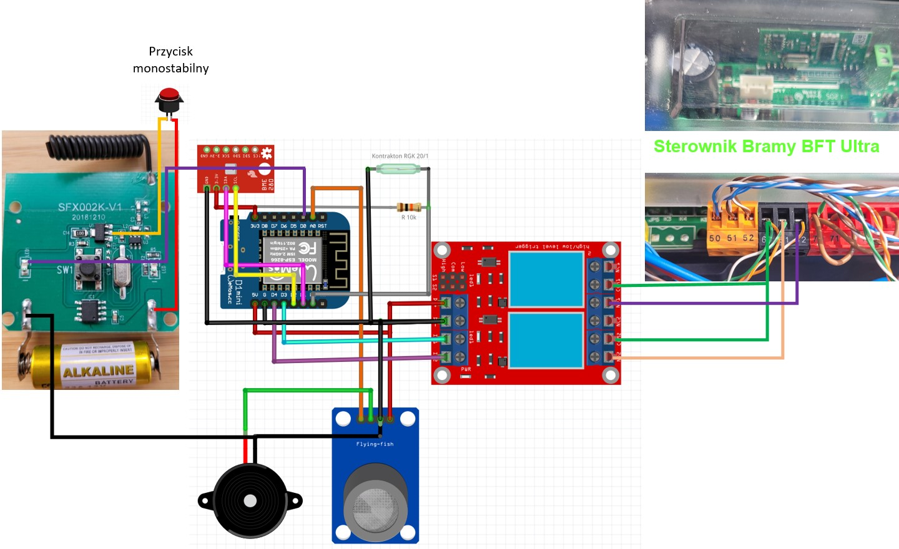

# BFT-WemosD1-Cacazi
Automatyzacja pozwalająca sterować bramą wyposażoną w sterowik BFT Ultra. W moim przypadku BFT DEIMOS ULTRA A600.
Projekt oparty na ukłądzie WeMos D1 mini z wgranym oprogramowaniem <a href="https://ota.tasmota.com/tasmota/release/tasmota-sensors.bin">tasmota-sensor.bin/</a>
W związku z tym, że sterownik zamontowałem w kotłowni to rozszerzyłem jego funkcjonalność o czujnik gazu z sygnalizacją dźwiękową i czujnik BMP280 dostarczający pomiara ciśnienia i temperatury. W projekcie można wykorzystać dowolny czujnik BMP lub BME.
Całość zintegrowałem z HomeAssistant dodając automatyzację z powiadomieniami na telefon z możliwością otwarcia furtki bądź bramy bezpośrednio z powiadomienia. W powiadomieniu otzymuję zrzut z kamery zamontowanej na wejście.
Dodatkowo zastosowany wodoodporny przycisk monostabilny uruchamia bezprzewodowy dzwonek Cacazia. Pilot dzwonka oparty o płytę sfx002k.
Tzykrotne wciśnięcie dzwonka (dodatkowego przycisku) otwiera furtkę, a czterokrotne bramę.

# Wymagane podzespoły
Podzespoły:
- Sterownik BFT DEIMOS ULTRA A600.
- Dzwonek Cacazi (sfx002k)
- WeMos D1 mini;
- <a href="https://pl.aliexpress.com/item/1624699191.html?spm=a2g0o.order_detail.order_detail_item.13.730643ce0oZFCj&gatewayAdapt=glo2pol">Moduł przekaźnikowy</a>
- Dowolny moduł BMP BME;
- Czujnik gazu np MQ-9;
- Głośniczek; 
- Przycisk monostabilny;
- Przekaźnik kontaktronowy np. RGK 20/1
- Rezystor 10k;
- parę przewodów;

# Wymagane oprogramowanie
Oprogramowanie:
- Serwer HomeAssistant;
- Serwer MQTT;
- Wemos D1 mini z wgranym softem Tasmota-Sensor;

# Schemat
Schemat połączenia podzespołów:


# Prototyp
Prototyp:

# Kontrakton
Miejsce zamontowania kontraktonu:


# Konfiguracja Tasmota
Add listed below configuration in console:
```shell
SetOption73 1
Backlog ButtonTopic 0
ButtonRetain off
# Furtka po 3 naciśnięciach
Rule1 ON Button1#state=12 DO publish cmnd/brama/POWER1 3 ENDON


# Brama po 4 naciśnięciach
Rule2 ON Button1#state=13 DO publish cmnd/brama/POWER2 3 ENDON
BlinkCount 1

#Powiadomienia MQTT to HA
Rule3 ON Button2#state=15 DO publish stat/czujnik/brama Open ENDON
      ON Button2#state=3 DO publish stat/czujnik/brama Close ENDON
      ON Button1#state DO publish stat/czujnik/dzwonek %value% ENDON

# Relay 2 0,5s
PulseTime2 5
```

# Konfiguracja Homeassistant
`vi  ./HA/config/configuration.yaml`

Add listed below configuration:
```shell
  sensor:
   -  unique_id: brama_button1
      name: "Brama dzwonek"
      state_topic: "stat/czujnik/dzwonek"
      expire_after: 5
   -  unique_id: brama_button2
      name: "Brama czujnik"
      state_topic: "stat/czujnik/brama"
```
Add config to your HA lovelace file.
[lovelace.yaml](lovelace.yaml) \

Add config to your Automation file.
[automation.yaml](automation.yaml) \
Rezultat:


# Troubleshooting
Check received data on MQTT server: \
 `mosquitto_sub -h localhost -p 1883 -u user -P Password -t collectd/# -d`
